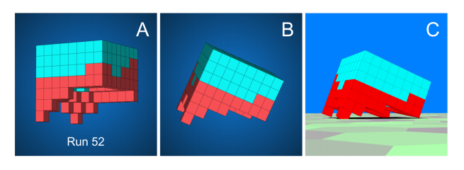
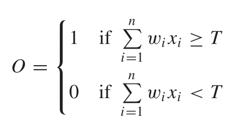
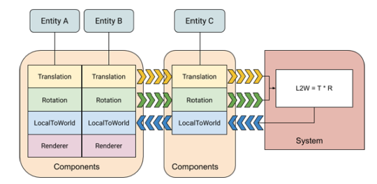
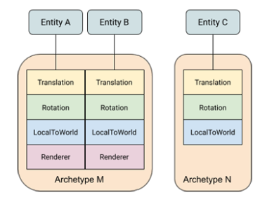

`TRABAJO EN PROCESO`

# Implementación de una Red Neuronal Evolutiva mediante Data-Oriented Design

`Los ítems con este formato hacen referéncia a aspectos en desarrollo o a referencias usadas.`
`Únicamente hay añadido el contenido en trabajo o finalizado. Es por este motivo que puede faltar algún punto.`

#### ***Autor: Raúl García Alcázar*** 
#### ***Tutor: Rafael González Fernández***
#### ***Grado: Grado en Diseño y Producción de Videojuegos.***
#### ***Universidad: TecnoCampus Mataró***

## Índice
```
1. Introducción --- OK
2. Objetivos --- OK 
    2.1. Objetivos principales --- OK 
    2.2. Objetivo secundario --- OK 
3. Análisis de referentes --- OK
    3.1. Xenobots --- OK
    3.2. Overwatch --- OK
    3.3. Unity3D --- OK
4. Marco teórico --- OK 
    4.1. Inteligencia Artificial --- OK 
        4.1.1. Computación Evolutiva --- OK
            4.1.1.1. Contexto --- OK
            4.1.1.2. Terminología --- OK
                4.1.1.2.1. Generación --- OK
                4.1.1.2.2. Genotipo y Fenotipo --- OK
                4.1.1.2.3. Población --- OK
                4.1.1.2.4. Evaluación y aptitud --- OK
                4.1.1.2.5. Operadores --- OK
            4.1.1.3. Entrenamiento y Aprendizaje --- OK
            4.1.1.4. Aplicación --- OK
                4.1.1.4.1. Algoritmo genético --- OK
        4.1.2. Red Neuronal Artificial --- OK
            4.1.2.1. Contexto --- OK
            4.1.2.2. Terminología --- OK
                4.1.2.2.1. Neurona y Perceptron --- OK
                4.1.2.2.1. Función de activación --- OK
                4.1.2.2.2. Capa --- OK
            4.1.2.3. Entrenamiento y Aprendizaje --- OK
        4.1.3. Red Neuronal Artificial Evolutiva
            4.1.3.1. Contexto
            4.1.3.2. Terminología
            4.1.3.3. Entrenamiento y Aprendizaje
            4.1.3.4. Aplicación
    4.2. Implementación --- OK
        4.2.1. Data-Oriented Design --- OK
            4.2.1.1. Contexto --- OK
                4.2.1.1.1. Arquitectura de un ordenador
                4.2.1.2.2. Historia --- OK
            4.2.1.2. Aplicación --- OK
                4.2.1.2.1. Array of Structs y Struct of Arrays --- OK
                4.2.1.2.2. Entity System o Entity Component System --- OK
            4.2.1.3. Características --- OK
        4.2.2. Unity3D --- OK
            4.2.2.1. Contexto --- OK
            4.2.2.2. Lenguaje C# --- OK
            4.2.2.3. Versiones de Unity3D y Unity's Package Manager --- OK
        4.2.3. Unity Data-Oriented Tech Stack (DOTS) --- OK
            4.2.3.1. Contexto --- OK
            4.2.3.2. ECS --- OK
                4.2.3.2.1. Archetypes --- OK
                4.2.3.2.2. ArchetypeChunk --- OK
                4.2.3.2.3. Entity Queries --- OK
            4.2.3.3. C# Job System --- OK  
            4.2.3.4. Burst Compiler --- OK 
            4.2.3.4. Otros paquetes --- OK
5. Diseño metodológico y cronograma
6. Resultados del trabajo
7. Conclusiones y reflexión
8. Bibliografía  
```
## 1. Introducción.
Durante varios años, en la indústria de videojuegos se ha debatido el concepto Data-Oriented Design (DOD) debido al gran impacto en rendimiento que ofrece dicho paradigma. Con la presentación de la pila de tecnologías basadas en datos (DOTS) por parte de Unity Technologies, se ha puesto al paradigma de programación orientada a datos en el punto de mira. 

Además, existe una vertiente dentro del sector que utiliza la inteligencia artificial (AI) para realizar o ayudar en el desarrollo de videojuegos. Se pueden observar herramientas de remasterización, herramientas de generación de escenarios y el uso de AI para generar misiones como es el caso de Skyrim.

Este proyecto busca enlazar los conceptos de DOD y AI en el desarrollo de videojuegos. Por este motivo, el objetivo del trabajo es implementar un modelo de inteligencia artificial concreto mediante el uso de este paradigma de programación. Al finalizar el desarrollo, se espera disponer de un sistema que ayude a diseñar y entrenar el comportamiento de los NPCs de un juego.

Este documento se ha dividido en diferentes capítulos que se dividen en dos grandes bloques. El primer bloque consiste en la investigación y documentación, en donde se encuentran los objetivos, los referentes y el marco teórico. Seguidos por los capítulos que forman parte del bloque de desarrollo del proyecto, en donde se define la metodología, la planificación, las herramientas usadas y se implementan los conceptos. Finalmente se describen las conclusiones obtenidas en la realización del trabajo.


## 2. Objetivos.
En esta sección se detallan los objetivos presentes en la realización de este proyecto. Estos objetivos han estado divididos según su tipología para con el proyecto. A continuación se detallan los objetivos principales seguidos por los objetivos secundarios.

### 2.1. Objetivos principales.
El proyecto tiene como finalidad la investigación, documentación y implementación de una red neuronal evolutiva mediante Data-Oriented Design. Se pueden
observar como objetivos principales los siguientes objetivos:

1. Implementar modelos de redes neuronales evolutivas mediante programación orientada a datos.

1. Investigar y documentar sobre la programación orientada a datos y los conceptos de inteligencia artificial utilizados.

### 2.2. Objetivo secundario.
En la realización del primer objetivo principal, también se realiza el siguiente objetivo secundario. Objetivo que sirve para evaluar que tipo de sinergia aporta el uso del paradigma objeto del trabajo a los conceptos de inteligencia artificial propuestos.

1. Identificar las ventajas e inconvenientes del paradigma Data-Oriented Design en la construcción de modelos de red neuronales y algoritmos evolutivos.

## 3. Análisis de referentes.
En esta sección se detallan los diversos referentes de este proyecto en materia de inteligencia artificial y aplicación del paradigma de programación orientado a datos. En primer lugar, se expone un estudio que aplica uno de los conceptos de inteligencia artificial de interés en este proyecto. Posteriormente, se observa un juego con un gran éxito comercial desarrollado con principios y sistemas de programación orientada a datos. Finalmente se menciona un programa que esta siendo reescrito a nivel de código para implementar el paradigma de orientación de datos.

### 3.1. Xenobots.
Los xenobots son organismos biológicos sintéticos creados célula a célula que con su estructura pueden realizar tareas sencillas (Kriegman et al, 2019).

`Kriegman, S. Blackiston, D. Levin, M. Bongard, J. (2019) A scalable pipeline for designing reconfigurable organisms.`

Se podría decir que se trata de robots construidos con células vivas. De hecho, el nombre de xenobot proviene del origen de las células usadas. Esas células provienen de la especie Xenopus laevis, un tipo de rana que tiene posee un tamaño de embrión superior a la media.


`Kriegman, S. (2019) Computer-designed organisms. A scalable pipeline for designing novel organisms, such as xenobots. Recuperado de https://cdorgs.github.io/`

Para la creación de estos bots, se realiza una búsqueda de formas viables que posteriormente son replicadas biológicamente. Esta búsqueda, se basa en la emulación de las células y se lleva a cabo mediante un algoritmo evolutivo. Las células usadas son células cardiacas (que realizan contracciones y expansiones) y células de piel (que sirven como unión)



`Kriegman, S. (2019) Computer-designed organisms. A scalable pipeline for designing novel organisms, such as xenobots. Recuperado de https://cdorgs.github.io/`

Los modelos son sometidos a una evaluación y van sufriendo cambios durante el paso del tiempo de manera que cuando más tiempo se realiza la búsqueda, más óptima es la forma encontrada.


`Kriegman, S. (2019) Computer-designed organisms. A scalable pipeline for designing novel organisms, such as xenobots. Recuperado de https://cdorgs.github.io/`

Para este proyecto, los xenobots son una referencia debido a la utilización de inteligencia artificial, en concreto el algoritmo evolutivo, para obtener una solución compleja y difícil de definir previamente.

### 3.2. Overwatch.
Overwatch es un videojuego desarrollado por Blizzard Entertainment publicado en 2016. Es un juego multijugador catalogado dentro del género First Person Shooter en concreto en el Hero Shooter. Un juego en primera persona en el que los personajes que se controlan disponen de habilidades diferentes según el héroe escogido, obligando al jugador a tener un estilo de juego diferente por héroe seleccionado.

Se trata de un juego de éxito, dispone de más de 40 millones de ventas y superó los mil millones de dólares por comercialización antes de cumplir con su primer aniversario.


`Gallego. (2016). Análisis de Overwatch, el shooter que estabas esperando (quizás sin saberlo). Vidaextra. Recuperado el 8 de febrero de 2021 de https://www.vidaextra.com/analisis/analisis-de-overwatch-el-shooter-que-estabas-esperando-quizas-sin-saberlo`

Timothy Ford, trabajador de Blizzard, detallo en la GDC (2019) como este juego fue desarrollado implementando la programación orientada a datos en concreto la arquitectura ECS que se detalla en el capítulo 4.2.1.2.2. El juego proporciona un ejemplo de como esta implementación puede ser usada en juegos con enfoque comercial. Además también valida su uso para futuros proyectos y consolida que este tipo de programación proporciona beneficios concretos. 

`Ford. T. (2019). Overwatch Gameplay Architecture and Netcode [Vídeo]. Recuperado de https://www.youtube.com/watch?v=W3aieHjyNvw`

### 3.3. Unity3D.
Unity3D es un motor de videojuegos que permite crear y desarrollar juegos o software basado en gráficos (Películas animadas, exposiciones en VR,…) con facilidad. Proporciona una serie de herramientas y librerías útiles en la realización del desarrollo que de otra manera, un desarrollador podría dedicar años en crear. Centra los esfuerzos del desarrollo en el producto y no en la herramienta.

Se trata de un programa muy popular. En 2019, el 53% de los 1000 juegos de móvil más rentables del mundo habían sido desarrollados con el programa Unity3D y además, los juegos desarrollados con esta herramienta para ordenadores, consolas y móviles representaban más de un 50% del total (Unity Technologies, s.f.).

`Unity Technologies. (s. d.). Welcome to Unity. Recuperado el 8 de febrero de 2021 de https://unity.com/our-company`

Actualmente, los desarrolladores de Unity3D están realizando una serie de cambios en el programa con la intención de mejorar el rendimiento de éste y así ofrecer una mejor herramienta a los usuarios. Estos cambios pasan por reescribir el programa utilizando el paradigma de programación orientado a datos.

Unity3D esta realizando una evangelización de la programación orientada a datos y es gracias a ellos que a día de hoy, en el sector de videojuegos empieza a ser un término conocido. Además, ofrecen librerías para empezar a usar estos nuevos sistemas.

## 4. Marco teórico.
Este proyecto se centra en la implementación de conceptos de inteligencia artificial aplicando un paradigma de programación específico. Para entender el funcionamiento de dichos conceptos hay que disponer de nociones de inteligencia artificial y conceptos de desarrollo de software. 

Por ello, el capítulo se ha dividido en dos grandes secciones de interés. La primera sección, la inteligencia artificial, concreta y expone los campos en los que se centra el proyecto. La segunda y última sección, entra en detalle sobre las tecnologías usadas, arquitectura de un ordenador y el tipo de programación usada en la implementación del proyecto.


### 4.1. Inteligencia Artificial.
Para entender que es la inteligencia artificial (en adelante AI) hay que entender cada una de las palabras que componen el término.

Actualmente, no existe un consenso en la definición de inteligencia. Aún así, la gran mayoría de los autores actuales estan de acuerdo o se basan en la teória de las inteligencias múltiples (Gardner, 1983).

`Gardner, H. (1983) Multiple intelligences.`

Esta falta de consenso se puede observar en la definición aportada por la Real Academia Española (2020): "inteligencia: 1. Capacidad de entender o comprender. 2. Capacidad de resolver problemas. 3. Conocimiento, comprensión, acto de entender. 5. Habilidad, destreza y experiencia."

`Real Academia Española. (2020). Diccionario de la lengua española (23.4 ed.). Consultado en https://www.rae.es`

En este documento, se recoge la definición de inteligencia propuesta por Piaget (1963). La inteligencia es la capacidad de adaptarse. Entendiendo la adaptación como una palabra que agrupa varias de las definiciones aportadas anteriormente.

`Piaget, J. (1963) The Origins of Intelligence in Children`

Una vez definido el concepto de inteligencia, queda concretar a que se refiere el adjetivo artificial. Si se observa el diccionario de la lengua española, el concepto articial puede definirse como: no natural, falso o hecho por el hombre (RAE, 2020). 

`Real Academia Española. (2020). Diccionario de la lengua española (23.4 ed.). Consultado en https://www.rae.es`

Haciendo un ejercicio de comprensión, se pueden extraer tres posibles definiciones mediante la combinación de los conceptos:
1. La inteligencia artificial es la capacidad de adaptarse no natural.
1. La inteligencia artificial es la capacidad de adaptarse falsa.
1. La inteligencia artificial es la capacidad de adaptarse hecha por el hombre.

Estas definiciones en ningún caso son definiciones correctas pero permiten observar que el término artificial puede generar confusión, ya que por ejemplo, no se trata de una inteligencia falsa. De hecho, según John Haugeland (1989), el término más correcto para entender el concepto de inteligencia artificial es referirse a ella como inteligencia sintética.

`Haugeland, J. (1989) Artificial intelligence: The very idea.`

Para entender mejor a que se refiere por sintética se puede observar el siguiente ejemplo:
Una perla artificial es una perla falsa. Por lo tanto, no es una perla real. En cambio, una perla sintética no es natural pero si es una perla real (Poole, Mackworth & Goebel, 1998).

`Poole, D. Mackworth, A. Goebel,R. (1998) Computational Intelligence: A Logical Approach.`

Llegados a este punto, en el que se ha identificado que una AI es una inteligencia real, en este documento se recoge la definición proporcionada por Andreas Kaplan y Michael Haenlein (2019) que define la AI como la capacidad de un sistema para interpretar y aprender sobre datos externos y emplear el conocimiento aprendido para lograr tareas y metas a través de la adaptación.

`Kaplan, A. Haenlein, M. (2019) Siri, Siri, in my hand: Who’s the fairest in the land? On the interpretations, illustrations, and implications of artificial intelligence`

Se trata de una definición que engloba la definición de Piaget (1963) y lo situa en un entorno "computacional" al introducir el concepto de datos y sistema. 

`Piaget, J. (1963) The Origins of Intelligence in Children`

La AI se divide en varias ramas. En este documento, se describen diferentes técnicas de AI que pertenecen a la rama de inteligencia computacional. Rama que se dedica a crear sistemas inteligentes que pueden percibir y razonar sin mucha idea (a priori) de su entorno y producen mecanismos de control y adaptabilidad de una manera robusta (Siddique & Adeli, 2013).

`Siddique, N. & Adeli, H. (2013) Computational Intelligence: Synergies of Fuzzy Logic, Neural Networks and Evolutionary Computing`

A continuación se describen dos campos de la inteligencia computacional: la computación evolutiva y la red neuronal. Finalmente, se detalla una técnica de AI que combina dichos campos para la creación del sistema computacional.

#### 4.1.1. Computación Evolutiva.
En este punto se describe en que consiste la computación evolutiva así como el algoritmo evolutivo. Primero se situa un contexto y punto de partida, seguido por una explicación de la terminología y el método de aprendizaje. Finalmente, se menciona el tipo de aplicación de algoritmo evolutivo usada en el desarrollo del proyecto.

##### 4.1.1.1. Contexto.
Para entender el campo de la computación evolutiva (en adelante EC), hay que entender a que se refiere con el término evolutiva.

Este término es usado con el mismo proposito que se utiliza en biología. Se trata de la evolución de las especies. Concretamente y de manera general, se basa en la evolución por selección natural definida por Charles Darwin (1859). 

Según Darwin, la selección natural tiene las siguientes premisas:
1. Los organismos se reproducen y los descendientes heredan las características de sus progenitores.
1. Los organismos han de presentar unas características diferenciadas o variables entre ellos.
1. Las diferencias en las características dan lugar a diferencias en la supervivencia y reproducción de los organismos.

De esta manera, si las premisas se repiten durante el transcurso de varias generaciones, se puede observar como ciertas características perduran en el tiempo y otras son eliminadas. Esta acumulación de cambios de características a lo largo de generaciones es a lo que se denomina evolución.

`Darwin, C. (1859) On the Origin of Species.`

En las ideas anteriores es en lo que se basa la computación evolutiva (EC). Por lo tanto, se puede definir la EC como la emulación del proceso de selección natural en un proceso de búsqueda (Siddique & Adeli, 2013).

`Siddique, N. & Adeli, H. (2013) Computational Intelligence: Synergies of Fuzzy Logic, Neural Networks and Evolutionary Computing`

El término de búsqueda utilizado en la anterior definición es entendido como el proceso que se realiza para encontrar una solución a un problema concreto según un criterio de validación. Según lo que se observa con la evolución, los individuos más aptos (considerados los más próximos al criterio de validación) son los que perduran en el tiempo. Por lo tanto, se espera que en cada generación, los individuos más aptos sean más óptimos o igual de óptimos que la generación anterior. Por este motivo, la computación evolutiva es catalogada como un tipo de función de optimización (Siddique & Adeli, 2013).

`Siddique, N. & Adeli, H. (2013) Computational Intelligence: Synergies of Fuzzy Logic, Neural Networks and Evolutionary Computing`

Toda aplicación de la EC presenta lo que se conoce como algoritmo evolutivo (en adelante EA) pero con ciertas variaciones. A continuación se representa un ciclo del EA general.


Algoritmo evolutivo.
`Siddique, N. & Adeli, H. (2013) Computational Intelligence: Synergies of Fuzzy Logic, Neural Networks and Evolutionary Computing`


##### 4.1.1.2. Terminología.
A continuación, se presenta la terminología general que presentan las aplicaciones del algoritmo evolutivo. Con los siguientes conceptos se puede entender mejor el AE representado en la figura anterior.

###### 4.1.1.2.1. Generación.
Una generación equivale a un ciclo entero del algoritmo evolutivo. Dispone del término generación debido a la connotación evolutiva que proporciona la herencia. Ya que, en cada ciclo, la población corresponde a la herencia del ciclo anterior.

###### 4.1.1.2.2. Genotipo y Fenotipo.
En la computación evolutiva (EC) se utilizan los términos biológicos de genotipo y fenotipo.

El genotipo describe la composición genética de un individuo y el fenotipo es la expresion de los rasgos en un entorno específico (Mendel, 1866). 

`Gregor, M. (1866). Versuche über Plflanzen-hybriden. Verhandlungen des naturforschenden Ver-eines in Brünn, Bd. IV für das Jahr 1865, Abhand-lungen, 3–47.`

A continuación, se puede observar una tabla en la que se puede apreciar de manera visual estos dos términos.


Tabla de flores de Mendel.

`Genotip. (s.f.). En Wikipedia. Recuperado el 17 de abril de 2021 de https://ca.wikipedia.org/wiki/Genotip`

El genotipo es el conjunto de genes (B o b) y el fenotipo es la representación de rasgos que se observan, flores de diferentes colores. Observando el fenotipo de la flor blanca, podemos deducir su genotipo. En cambio, si se observa la flor de color, observamos que es más probable que disponga de un genotipo que otro, pero no es posible saber que genotipo dispone.

Si se analizan los términos a nivel de EC, se entiende el genotipo como la codificación de información de un individuo y el fenotipo como los individuos que forman las posibles soluciones en un contexto original del problema (Siddique & Adeli, 2013).

`Siddique, N. & Adeli, H. (2013) Computational Intelligence: Synergies of Fuzzy Logic, Neural Networks and Evolutionary Computing`

Según la aplicación del algoritmo evolutivo que se realize y según el problema a resolver, estos términos de los individuos, tienen mayor o menor peso en la implementación y se representan o codifican de manera diferente.

###### 4.1.1.2.3. Población.
La población es el conjunto de individuos utilizados en el transcurso del algoritmo evolutivo y de los que se acaba extrayendo un único individuo (fenotipo) como solución (Della et al, 2004).

`Della, A. De Stefano, C. Marcelli, A. (2004) On the role of population size and niche radius in fitness sharing.`

En cada generación, los individuos de la población son sustituidos por su herencia pero el número máximo de individuos es una constante establecida al inicio del proceso.

De hecho, al inicio de proceso hay que establacer dos aspectos de la población:
- Informar el número de individuos (tamaño de la población).
- Inicializar la población inicial.

El tamaño de la población es un aspecto importante en el rendimiento del algoritmo evolutivo. A nivel de variabilidad, cuanto mayor población mejor. La variabilidad ayuda a poder encontrar un fenotipo de éxito en menor tiempo (tiempo medido en generaciones). A nivel de tiempo de cálculo, cuanto mayor es la población, más calculos se han de realizar y por lo tanto puede convertirse en una tarea lenta y ineficiente. Por otro lado, si la población es demasiado pequeña, puede ser más rápida a nivel de cálculos, pero tardará más en encontrar un fenotipo de éxito (Federico, 2005). En 1975, Teniendo en cuenta el estado del hardware, DeJong comprobo que las poblaciones más eficaces eran entre 20 y 100 individuos (1975). 

`Federico, L. (2005) Entrenamiento de redes neuronales basado en algoritmos evolutivos.`

`DeJong, K. (1975). An Analysis of the Behavior of a Class of Genetic Adaptive Systems. PhD Dissertation, Department of Computer and Communication Sciences, University of Michigan, Ann Arbor.`

Sobre la inicialización, existen diferentes técnicas que se pueden utilizar como una inicialización manual, una uniforme para abarcar el espectro máximo de posibles fenotipos o de manera aleatoria (la más común) entre otras (Hidalgo & Turrado, 2011).

`Hidalgo, J. Turrado, J. (2011) Algoritmos genéticos: Aplicación al problema de la mochila.`

###### 4.1.1.2.4. Evaluación y aptitud.
Según se ha observado, el algoritmo se reproduce por generaciones. En cada generación, la población es modificada realizando una simulación de evolución genética y mediante la selección natural, los individuos más aptos son los que mayor herencia disponen.

Para seleccionar los individuos que se reproducen en la siguiente generación, hay que disponer de un criterio de rendimiento de los individuos (Siddique & Adeli, 2013). Según el objetivo del algoritmo evolutivo, se puede usar una función de evaluación o una función de aptitud.

`Siddique, N. & Adeli, H. (2013) Computational Intelligence: Synergies of Fuzzy Logic, Neural Networks and Evolutionary Computing.`

Es común usar los conceptos de función de evaluación y función de aptitud como sinonimos, pero son distintos (Federico, 2005). 

`Federico, L. (2005) Entrenamiento de redes neuronales basado en algoritmos evolutivos.`

La función de evalución, provee una medida de optimización sobre un conjunto de parámetros. Indica que tan buena es una posible solución independientmente del resto de posibles soluciones (Whitley, 1994).

`Whitley, D. (1994). A genetic algorithm tutorial. Statistics and computing.`

Por el contrario, la función de aptitud indica que tan buena (o mala) es una posible solución en comparación con el resto de posibles soluciones (Federico, 2005).

`Federico, L. (2005) Entrenamiento de redes neuronales basado en algoritmos evolutivos.`

###### 4.1.1.2.5. Operadores.
En cada generación del algoritmo evolutivo (EA) se han de crear los nuevos individuos a través de la aplicación de operadores. Los operadores son aplicados mediante el orden definido en la siguiente lista de puntos.

**Selección**.
La selección consiste en la elección de unos individuos de la actual generación que serviran como base para la reproducción de la siguiente generación. La selección se puede realizar utilizando diferentes estrategias. Generalmente se utiliza una selección en base a la aptitud de los individuos. Existen otras estrategias como pueden ser la aleatoria, la ruleta y el elitismo entre otras (Siddique & Adeli, 2013). Ninguna estrategia es correcta o incorrecta, depende del dominio del problema a resolver, puede ser más adecuadop usar una u otra.

`Siddique, N. & Adeli, H. (2013) Computational Intelligence: Synergies of Fuzzy Logic, Neural Networks and Evolutionary Computing`

**Cruce**.
Una vez se ha realizado la selección de los individuos a reproducir, entra en acción la operación de cruce. Es esta operación la responsable de generar nuevos genotipos y por lo tanto, la responsable de que aparezcan nuevos fenotipos (Siddique & Adeli, 2013).

`Siddique, N. & Adeli, H. (2013) Computational Intelligence: Synergies of Fuzzy Logic, Neural Networks and Evolutionary Computing`

Existen tres clases de operaciones de cruce.
- Asexual. Cuando un solo individuo es utilizado para generar un nuevo individuo.
- Sexual. Cuando dos individuos son utilizados para generar un nuevo individuo.
- Multi-parent. Cuando más de dos individuos son utilizados para generar un nuevo individuo.

Para la realización de la nueva generación a través del cruce, se tienen presente dos parámetros necesarios:

- La probabilidad de cruce. Indica que tanto por ciento de la población se ha creado mediante el cruce de varios individuos. Por ejemplo, si el valor es un 60%, el 40% de la nueva población ha sido generada por un cruce asexual. En cambio, el otro 60%, ha sido creado mediante un cruce sexual o multi-parent.
- El punto de cruce. Punto en el que se define que genes del genotipo son cruzados. Pueden existir más de un punto de cruze en una misma operación de cruce.

En la siguiente figura se puede observar un ejemplo de cruze sexual con dos puntos de cruce.


`Siddique, N. & Adeli, H. (2013) Computational Intelligence: Synergies of Fuzzy Logic, Neural Networks and Evolutionary Computing`

A nivel de genotipo y usando el ejemplo proporcionado por la figura anterior, se podria realizar la representación siguiente. Se trata de un genotipo binario con dos puntos de cruce.


`Siddique, N. & Adeli, H. (2013) Computational Intelligence: Synergies of Fuzzy Logic, Neural Networks and Evolutionary Computing`

El resultado del cruce es la definición de la nueva población. Una vez finalizado este operador, ya se dispone de todos los individuos de la nueva generación.

Existen otras formas de realizar el cruce que no consisten en unicamente seleccionar los genes del genotipo a cruzar. Algunas de ellas consisten en aplicar funciones aritméticas a genes concretos o al total de los genes (Siddique & Adeli, 2013) y otras por cruze binomial según la aptitud de los padres (Federico, 2005).

`Siddique, N. & Adeli, H. (2013) Computational Intelligence: Synergies of Fuzzy Logic, Neural Networks and Evolutionary Computing`

`Federico, L. (2005) Entrenamiento de redes neuronales basado en algoritmos evolutivos`

**Mutación**.
La mutación consiste en realizar un cambio concreto en un gen de un individuo. Este cambio solo se produce a través de un procentaje de mutación. Este porcentaje, ha de poseer un valor muy pequeño (0.001%) para no convertir la nueva generación en una muestra aleatoria (DeJong, 1975).

`DeJong, K. (1975). An Analysis of the Behavior of a Class of Genetic Adaptive Systems. PhD Dissertation, Department of Computer and Communication Sciences, University of Michigan, Ann Arbor.`

Por ejemplo, si se dispone de un genotipo binario, la mutación suele consistir en cambiar el valor de un gen al valor opuesto.


`Siddique, N. & Adeli, H. (2013) Computational Intelligence: Synergies of Fuzzy Logic, Neural Networks and Evolutionary Computing`

Existen diferentes formas de realizar cambios en los genes. Aplicar cambios de orden, aplicar operaciones matemáticas, invertir el signo del valor, ...

Una vez aplicado el operador de mutación, ya se dispone de una nueva generación de individuos diferentes a la anterior generación y es en este momento en el que se inicia de nuevo el ciclo de evaluación y aplicación de operadores sobre la población.

##### 4.1.1.3. Entrenamiento y Aprendizaje.
Como se ha mencionado, los fenotipos son las potenciales soluciones de un problema concreto y las generaciones, son cada una de las iteraciones que evalúa unos nuevos fenotipos.

Con estos dos conceptos, se puede observar que el sistema en cada generación selecciona (mediante el operador de selección) las soluciones más óptimas respecto los demás fenotipos de su generación. Los fenotipos seleccionados sirven como base genética para crear la población de la siguiente generación (mediante operadoes de cruce y mutación).

Por lo tanto, en cada generación se encontrará generalmente una solución igual o más óptima que la generación anterior. Solo es cuestión de repetir el proceso hasta encontrar una solucción deseada.

##### 4.1.1.4. Aplicación.
Como se ha comentado anteriormente, existen diversas variaciones de aplicación del algoritmo evolutivo y este hecho da lugar a una distinción de estrategias a seguir según el propósito.

A continuación se listan las diferentes variaciones de aplicación que existen:
1. Algoritmo genético (Holland, 1975).
`Holland, J. (1975). Adaptation In Natural and Artificial Systems. University of Michigan Press, Ann Arbor.`
1. Programación evolutiva (Fogel, 1962).
`Fogel, L.J. (1962) Autonomous automata, Industrial Research, 4, 14–19.`
1. Estrategias de evolución (Rechenberg, 1965).
`Rechenberg, I. (1965) Cybernetic Solution Path ofan Experimental Problem, Royal Aircraft Establishment, Library Translation No. 1122, Farnborough, UK.`
1. Programación genética (Friedberg, 1958).
`Friedberg, R.M. (1958) A learning machine: Part I, IBM Journal ofResearch and Development, 2(1), 2–13.`
1. Evolución diferencial (Storn, 1995).
`Storn, R. (1995) Constrained optimization, Dr. Dobb’s Journal, May, pp. 119–123.`
1. Algoritmo cultural (Reynolds, 1994).
`Reynolds, R.G. (1994) Introduction to cultural algorithms. In Proceedings of the Third Annual Conference on Evolutionary Programming, A.V. Sebald and L.J. Fogel (eds), World Scientific, Singapore, pp. 131–139.`

De las diferentes aplicaciones, este documento solo desarrolla y expone el concepto de algoritmo genético. Variación del algoritmo evolutivo que se utiliza en el desarrollo de la parte práctica del proyecto.

###### 4.1.1.4.1. Algoritmo genético.
El algoritmo génetico (en adelante GA) se trata de la aplicación del algoritmo evolutivo (EA) más popular. Es introducido y desarrollado por John H. Holland (1975) y sus estudiantes (DeJong, 1975). 

`Holland, J. (1975). Adaptation In Natural and Artificial Systems. University of Michigan Press, Ann Arbor.`

`DeJong, K. (1975). An Analysis of the Behavior of a Class of Genetic Adaptive Systems. PhD Dissertation, Department of Computer and Communication Sciences, University of Michigan, Ann Arbor.`

Este algoritmo tiene dos aspectos que lo diferencian de la aplicacion de EA por defecto.
1. El concepto de la genética y estructuración de datos.
1. Se basa en una función de coste que evalua únicamente la aptitud de los fenotipos.

Sobre el concepto genética, el término "genético" de los GA proviene de la emulación de poblaciones mendelianas. Poblaciones basadas en los modelos de herencia y evolución genética definidos por Gregor Mendel (1866). Los individuos de la población se representan mediante cadenas de información similares a una estructura genética como los cromosomas (Whitley, 1994). 

`Gregor, M. (1866). Versuche über Plflanzen-hybriden. Verhandlungen des naturforschenden Ver-eines in Brünn, Bd. IV für das Jahr 1865, Abhand-lungen, 3–47.`

`Whitley, D. (1994). A genetic algorithm tutorial. Statistics and computing.`

Sobre la función de coste, GA se basa en una función de coste que evalua a cada individuo según sus características respecto a los demás. Este planteamiento difiere a otras aplicaciónes del EA en las que se precisa una descripción matemática del problema a optimizar (Goldberg, 1989).

`Goldberg, D. (1989). Genetic Algorithms in Search, Optimization& Machine Learning.`

El algoritmo genético se puede considerar una aplicación del algoritmo evolutivo espejo. Aplica estrictamente dicho algoritmo pero con unas pequeñas diferencias que lo distinguen. A continuación, se nombran las diferencias que identifican un algoritmo genético en base a la terminología usada en el algoritmo evolutivo.

**Genotipo y Fenotipo:** en el algoritmo genético el genotipo se expresa como una cadena de valores representando el concepto genetico de cromosoma. 

**Evaluación y Aptitud:** únicamente se realiza una función de aptitud respecto el resto de cromosomas.


Al solo aplicar una evaluación de aptitud en base a la población, se puede considerar al algoritmo genético como un proceso que desconoce el espacio del problema a resolver. Aún así, es capaz de encontrar una posible solución partiendo de la aleatoriedad. Esto lo convierte en un proceso útil en problemas en los que se desconoce como se han de resolver (Siddique & Adeli, 2013).

`Siddique, N. & Adeli, H. (2013) Computational Intelligence: Synergies of Fuzzy Logic, Neural Networks and Evolutionary Computing.`

#### 4.1.2. Red Neuronal Artificial.
En este punto se detalla el concepto de red neuronal artificial. Primero se situa un contexto y una visión de su historia. A continuación se describe la terminología y sus métodos de aprendizaje. Por último, se realiza una mención a las diferentes aplicaciones existentes.

##### 4.1.2.1. Contexto.
Una red neuronal artificial (en adelante ANN) es un análogo eléctrico de una red neuronal biológica (Siddique & Adeli, 2013). 

`Siddique, N. & Adeli, H. (2013) Computational Intelligence: Synergies of Fuzzy Logic, Neural Networks and Evolutionary Computing.`

La red neuronal biológica esta compuesta por un conjunto de neuronas. Cada neurona posee un soma (input) y un axón (output). Además, las uniones entre neuronas siempre siguen un patrón de unión entre el axón de una primera neurona y el soma de una segunda. De esta manera, las neuronas estan conectadas entre si y cuando existe un impulso eléctrico, este impulso recorre las neuronas según las conexiones existentes (McCulloch & Pitts, 1943).

`McCulloch, W.S. and Pitts, W.H. (1943) A logical calculus of the ideas imminent in nervous activity, Bulletin of Mathematical Biophysics, 5, 115–133.`


Representación de neurona biológica

`Salman, A. (2009) An Open Domain-Extensible Environment for Simulation-Based Scientific Investigation (ODESSI).`

En la figura anterior, se observa la representación de una neurona biológica. Permite observar que disponen de ramificaciones en los puntos de conexión y es que las conexiones entre neuronas no tienen una relación de una a una, sinó que un soma puede estar conectado con múltipes axones de otras neuronas y un axón puede estar conectado con múltiples somas de otras neuronas.

La primera implementación de red neuronal artificial fue creada por Warren McCulloch y Walter Pitts. Modelaron una ANN simple mediante circuitos eléctricos y diseñaron la neurona artificial presente en la siguiente figura (McCulloch & Pitts, 1943).

`McCulloch, W.S. and Pitts, W.H. (1943) A logical calculus of the ideas imminent in nervous activity, Bulletin of Mathematical Biophysics, 5, 115–133.`


Neurona del modelo McCulloch y Pitts

`Siddique, N. & Adeli, H. (2013) Computational Intelligence: Synergies of Fuzzy Logic, Neural Networks and Evolutionary Computing.`

El funcionamiento del modelo representado en el diagrama anterior es el siguiente:
- "X" es el valor de entrada. Existen múltiples valores de entrada binarios (0 o 1) y los valores van variando durante la ejecución.
- "W" es el valor de peso de la entrada. Define que importancia tiene la entrada según la neurona y es definido en el diseño de la neurona. El valor es fijo durante la ejecución.
- "T" es el valor de umbral que ayuda a definir el valor de salida y es definido en el diseño de la neurona. El valor es fijo durante la ejecución.
- "O" es el valor de salida. Una única salida de valor binario y el valor va variando durante la ejecución.

Teniendo en cuenta las aclaraciones anteriores, se puede realizar una representación matemática. Esta representación se visualiza em la siguiente figura. 



`Siddique, N. & Adeli, H. (2013) Computational Intelligence: Synergies of Fuzzy Logic, Neural Networks and Evolutionary Computing.`

Como se puede observar, este modelo planteado únicamente reproduce la comunicación entre neuronas, pero es un modelo que no es capaz de aprender. Quien diseña el modelo define como funciona y este no varia. 

Es aquí donde entró Donald Hebb y introdujo un esquema de aprendizaje que utilizaba las neuronas como herramienta en donde guardar la información aprendida (Hebb, 1949). Este aprendizaje consiste en modificar los valores de los pesos en las conexiones para alterar el resultado final.

`Hebb, D.O. (1949) The Organization ofBehavior: A Neuropsychological Theory, John Wiley, New York.`

Unos años más tarde se introdujo un nuevo modelo de neurona que añadió un nuevo elemento de corrección a posibles errores. Se introdujo el concepto de "bias" a la equación (Rosenblatt, 1950). Además, durante la época en la que se propuso este nuevo modelo, hubo un cambio de terminología y se empezo a usar el término de perceptron.

`Rosenblatt, F. (1958) The perceptron: a probabilistic model for information storage and organisation in the brain, Psychology Review, 65, 386–408.`

Con la introducción del nuevo elemento, se puede observar una modificación de las equaciones y esquema anteriores.


Percerptron Rosenblatt

`Siddique, N. & Adeli, H. (2013) Computational Intelligence: Synergies of Fuzzy Logic, Neural Networks and Evolutionary Computing.`

Hasta los años 80, el interés general sobre la investigación y uso de redes neuronales era muy bajo debido a que el perceptron era un modelo muy limitado, no era capaz de resolver funciones no-lineales (Minsky and Papert, 1969). Todo cambió cuando John Hopfield presento un paper en donde demostraba el uso potencial de las redes neuronales para dispositivos reales (Hopfield, 1982). 

`Minsky, M. and Papert, S. (1969) Perceptrons, MIT Press, Cambridge, MA.`

`Hopfield, J.J. (1982) Neural networks and physical systems with emergent collective computational abilities, Pro- ceedings ofNational Academy ofSciences, 79, 2554–2558.`

Después del interés despertado por Hopfield, se realizaron o se descrubrieron trabajos de investigación que reconfigurarían las ANN a nivel de estructura, a nivel de aprendizaje y a nivel de optimización. Aquí se puede destacar una investigación que sucedió antes de los años 80 pero paso desapercibida. Se trata del aprendizaje de propagación hacia atrás (Werbos, 1974). Actualmente, uno de los métodos de aprendizaje de redes neuronales más usados.

`Werbos, P.J. (1974) Beyond regression: new tools for prediction and analysis in the behavioural sciences, Doctoral Dissertation, Applied Mathematics, Harvard University.`

Actualmente el modelo general de una ANN esta representado por la siguiente figura. Se trata de modelo perceptron multicapa.


Perceptron multicapa

`Siddique, N. & Adeli, H. (2013) Computational Intelligence: Synergies of Fuzzy Logic, Neural Networks and Evolutionary Computing.`


##### 4.1.2.2. Terminología.
A continuación se detalla la terminología usada en las ANN y se oberva como es el modelo actual de red neuronal artificial general, entrando en detalle en cada concepto del perceptron multicapa.

###### 4.1.2.2.1. Neurona y Perceptron.
La neurona o Perceptron es un elemento de procesamiento (Yao, 1999). La modelo actual de la neurona presenta la siguiente representación.

`Yao, X. (1990) Evolving artificial neural networks` 


Perceptron

`Siddique, N. & Adeli, H. (2013) Computational Intelligence: Synergies of Fuzzy Logic, Neural Networks and Evolutionary Computing`

El modelo actual es prácticamente el mismo que el presentado por Rosenblatt (1958), pero con la evolución de las redes neuronales, se ha definido de forma diferente algun concepto para una mayor abstracción y mejor flexibilidad. De hecho, el elemento más diferenciador entre los dos modelos es la identificación de la función de activación ( ***f(.)*** ).

`Rosenblatt, F. (1958) The perceptron: a probabilistic model for information storage and organisation in the brain, Psychology Review, 65, 386–408.`

Con este nuevo concepto identificado, las equaciones matemáticas también han variado en cierta medida. A continuación se observa el proceso matemático que sigue una neurona para obtener su valor de salida. 


`Siddique, N. & Adeli, H. (2013) Computational Intelligence: Synergies of Fuzzy Logic, Neural Networks and Evolutionary Computing`

Primero se calcula el valor de salida sin aplicar la función de activación aplicando una suma ponderada y aplicando una desviación de umbral. Posteriormente, se aplica la función de activación.


`Siddique, N. & Adeli, H. (2013) Computational Intelligence: Synergies of Fuzzy Logic, Neural Networks and Evolutionary Computing`

El valor resultante de la función de activación, es el valor que recibirà la siguiente neurona situada en la siguiente capa.

###### 4.1.2.2.1. Función de activación.
La función de activación permite definir el tipo de salida de una neurona (lineal o no-lineal). Este concepto existía desde el primer modelo de neurona (McCulloch & Pitts, 1943) y también estaba presente en el modelo de perceptron de Rosenblatt (1958). Estos modelos usaban una función de activación del tipo escalón.

`McCulloch, W.S. and Pitts, W.H. (1943) A logical calculus of the ideas imminent in nervous activity, Bulletin of Mathematical Biophysics, 5, 115–133.`

`Rosenblatt, F. (1958) The perceptron: a probabilistic model for information storage and organisation in the brain, Psychology Review, 65, 386–408.`

A continuación se muestran las funciones de activación más típicas.


`Nacelle, A. (2009) Redes neuronales artificiales.`

Como se menciona anteriormente, los modelos iniciales ya presentaban el concepto de función de activación y concretamente la función de escalón (0 o 1 como valor). El uso de esta función fue debido al medio en el que se diseñaron los modelos. Se trata de una representación de circuito eléctrico en donde el valor "0" corresponde a que no hay impulso y el valor "1" a que hay impulso eléctrico. 

Esta función de activación de escalón, fue una de las limitaciones que se detectaron en los años 60. Matemáticamente, un conjunto de equaciones lineales dan como resultado una única ecuación lineal. Por lo que aunque se añadieran neuronas, el modelo siempre se podía simplificar en una única neurona (Minsky and Papert, 1969). Con la introducción de funciones no-lineales, esta limitación se remedió y a día de hoy permiten obtener resultados complejos medianto la combinación de neuronas y sus correspondientes funciones de activación.

`Minsky, M. and Papert, S. (1969) Perceptrons, MIT Press, Cambridge, MA.`

###### 4.1.2.2.2. Capa.
Una capa es una medio de agrupación de neuronas. Cada capa puede disponer de como mínimo una neurona y no existe un número determinado como máximo. Además, el resultado de las neuronas de cada capa es conectado con cada una de las neuronas de la siguiente capa (Nacelle, 2009). Existen variaciones en donde puede existir la no conexión entre algunas neuronas de capas contiguas, pero en términos generales, todas se conectan.

`Nacelle, A. (2009) Redes neuronales artificiales.`

En toda ANN existen mínimo dos capas. La capa de entrada y la capa de salida. Como su nombre indica, son las capas que se relacionan con aspectos externos. La primera recibe una série de datos y la segunda es la que comunica el resultado de esos datos procesados (Siddique & Adeli, 2013). Internamente, la red puede disponer de las denominadas capas ocultas. El número de capas ocultas depende del diseño que uno quiera realizar.

`Siddique, N. & Adeli, H. (2013) Computational Intelligence: Synergies of Fuzzy Logic, Neural Networks and Evolutionary Computing`


`Alvarado, M. Meneses-Bautista, F.D. (2017). Pronóstico del tipo de cambio USD/MXN con redes neuronales de retropropagación.`

El número de neuronas por capas es un número definido por el que diseña el modelo. Entiendiendo las neuronas como unidades de procesamiento (Yao, 1999), según el problema a resolver puede interesar disponer de más o menos neuronas, ya que que cada neurona puede llegar a especializarse en un ámbito del problema concreto.

`Yao, X. (1990) Evolving artificial neural networks`

Esta especialización en ningún caso es planteada en el diseño de la ANN. Se realiza una vez se ha entrenado la red.

##### 4.1.2.3. Entrenamiento y Aprendizaje.
El aprendizaje de una ANN es un procedimiento que modifica los pesos de las conexiones y la desviación del umbral de las neuronas. Este procedimiento es denominado entrenamiento y consiste en forzar a una red para dar un respuesta concreta a una entrada de datos específica (Siddique & Adeli, 2013).

`Siddique, N. & Adeli, H. (2013) Computational Intelligence: Synergies of Fuzzy Logic, Neural Networks and Evolutionary Computing`

Existen muchos procesos de aprendizaje, pero se pueden agrupar en dos tipos de aprendizaje:
- Aprendizaje supervisado
- Aprendizaje no supervisado

El aprendizaje supervisado consiste en proporcionar al modelo los datos de entrada y salida que se espera obtener con el procesamiento de la red. Una vez obtenido el valor proporcionado con la red, se compara con el objetivo y si existen diferencias de valores, se ajustan los pesos para aproximarse al resultado objetivo(Siddique & Adeli, 2013).

`Siddique, N. & Adeli, H. (2013) Computational Intelligence: Synergies of Fuzzy Logic, Neural Networks and Evolutionary Computing`

Respecto al aprendizaje no supervisado, se refiere al aprendizaje que no conoce el valor objetivo. Al no conocerse la información sobre si es correcto o incorrecto, el modelo busca regularidades, patrones o tendencias para ajustar sus pesos (Siddique & Adeli, 2013).

`Siddique, N. & Adeli, H. (2013) Computational Intelligence: Synergies of Fuzzy Logic, Neural Networks and Evolutionary Computing`

Existen diferentes técnicas para realizar cada uno de los aprendizajes mencionados. De entre ellas, se puede destacar al aprendizaje mediante la propagación hacia atrás (Backpropagation) que introdujo Werbos (1974). Se trata de un algoritmo de aprendizaje supervisado que optimiza el proceso de reconfiguración de la red neuronal respecto a otros procesos. En vez de recorrer cada una de las opciones posibles a través de las neuras para configurar sus pesos, realiza el mínimo recorrido necesario según el peso que a tenido una neurona en el error encontrado.

`Werbos, P.J. (1974) Beyond regression: new tools for prediction and analysis in the behavioural sciences, Doctoral Dissertation, Applied Mathematics, Harvard University.`

### 4.2. Implementación
La implementación que se realiza en este proyecto se basa en una série de tecnologías y patrones que caracterizan y diferencian este proyecto de otros que tratan las redes neuronales evolutivas.

De hecho, este proyecto esta más enfocado a observar de que manera se puede aplicar la sección anterior de inteligencia artificial en una manera de programar concreta. Se trata del concepto Data-Oriented Desgin.

A continuación se explica de que se trata dicho concepto a nivel teórico y se contextualiza en la herramienta utilizada (Unity3D) en el desarrollo.

#### 4.2.1. Data-Oriented Design 
El concepto de programación orientada a datos o Data-Oriented Design (en adelante DOD) se entendiende como una manera de programar que tiene el foco en los datos. El tipo de datos, cómo se guardan en memoria, cómo se leen y cómo se procesan durante la ejecución de un programa. Viene a resolver problemas derivados del cache miss y mejorar la velocidad de gestión de datos (Liechty, 2015). 

`Liechty, D. (2015). Object-Oriented/Data-Oriented Design of a Direct Simulation Monte Carlo Algorithm. Journal of Spacecraft and Rockets.`

Aunque para este paradigma los datos tienen gran relevancia, no hay que confundir el concepto de DOD con Data-Driven. La programación orientada a datos, se centra en la gestión de los datos y su relación con el hardware, mejorar o resolver problemas de rendimiento de acceso en memoria y/o utilizar patrones o estructuras específicas de datos entre otros. En cambio, el concepto Data-Driven a nivel general se puede entender como una estructura/sistema que proporciona a los datos mucha funcionalidad. Haciendo que los datos determinen el comportamiento de un programa (Llopis, 2009).

`Llopis, N. (2009). Data-Oriented Design (Or Why You Might Be Shooting Yourself in The Foot With OOP). Recuperado de https://gamesfromwithin.com/data-oriented-design/comment-page-1`

En resumen, el objetivo que busca el paradigma de programación orientada a datos es mejorar el rendimiento de los programas a través de la mejora en la gestión de datos en memoria.


##### 4.2.1.1. Contexto
Para entender mejor que significan los conceptos que componen el término DOD hay que diponer de nociones del funcionamiento de un ordenador y nociones de software. A continuación se exponen aquellos aspectos de la arquitectura de un ordenador necesarios para la comprensión del concepto y posteriormente, se detalla la historia este tipo de programación.

###### 4.2.1.1.1. Arquitectura de un ordenador

###### 4.2.1.2.2. Historia
El concepto de programación orientada a datos o Data-Oriented Design (en adelante DOD) fue introducido por John Sharp (1980) con la intención de mejorar la eficiencia del software en arquitecturas multiprocesador.

`Sharp, J. (1980). Data oriented program design. ACM SIGPLAN Notices.`

“Thinking about data first and architecting the program based on that brings along lots of advantages” (Llopis, 2009). Aunque fue introducido por John Sharp (1980), no es hasta que Noel Llopis en un artículo define y nombra como un paradigma el concepto de programación orientada a datos. En dicho artículo se expone una comparativa entre DOD y la programación orientada a objetos (OOP), proporcionando un conjunto de guías y filosofías a seguir. Es en este artículo en el que se basa la gran mayoría de literatura actual sobre el tema.

`Sharp, J. (1980). Data oriented program design. ACM SIGPLAN Notices.`

`Llopis, N. (2009). Data-Oriented Design (Or Why You Might Be Shooting Yourself in The Foot With OOP). Recuperado de https://gamesfromwithin.com/data-oriented-design/comment-page-1`

Todo trata sobre los datos. Todos los programas o aplicaciones producen y necesitan datos. Cualquier aplicación sin datos se queda en nada (Fabian, 2013, p.2). Cualquier tipo de programa requiere de acceso y control de datos. Por lo tanto, el concepto de DOD en teoría es aplicable a cualquier tipo de programa.

`Fabian, R. (2013). Data-Oriented Design.`

Se puede observar que hay un salto de casi 30 años des de que se nombró el concepto hasta que se ha recuperado. Esto se debe a la evolución que han experimentado el procesador y la memoria (detallados en el apartado anterior).


`Hennessy, J. L., & Patterson, D. A. (2011). Computer architecture: a quantitative approach. Elsevier.`

En la figura anterior se observa como el rendimiento de los procesadores (medido en diferencia de tiempo entre solicitud de memoria por núcleo de procesador) ha aumentado mucho más respecto al crecimiento de rendimiento que ha experimentado la memoria (medido en latencia de acceso a RAM) y es en este escenario en el que los desarrolladores implementan maneras de minimizar el impacto en rendimiento debido al acceso de datos en memoria.

En este punto, hay que mencionar que existe una controversia en si la programación orientada a datos es un paradigma o no. Este hecho se debe a que de una manera u otra, los programadores ya utilizaban las herramientas o seguían la filosofía del DOD antes de que se nombrara por primera vez como paradigma de programación. Además, se trata de un paradigma que puede convivir con otros simultáneamente y puede quedar en segundo plano si no se realiza a conciencia.

##### 4.2.1.2. Aplicación
DOD no proporciona unas guías únicas y específicas a seguir que puedan funcionar en todos los casos (a diferencia del OOP que proporciona las clases y herencia). Esto se debe a que no es un paradigma de organización de código en sí, sino que se centra en la comunicación entre código y máquina para una mayor eficiencia en gestión de datos. Esto conlleva en algunos casos en una escritura de código menos legible para los humanos pero más “entendible” para el hardware. Aún así, si existen una serie de estrategias de implementación y conceptos utilizados que se definen en los siguientes capítulos. En este proyecto se enumeran las implementaciones más usadas o conocidas.

###### 4.2.1.2.1. Array of Structs y Struct of Arrays
El concepto de Array of Structs (en adelante AoS) se trata de una estrategia de implementación de organización de datos que consiste en disponer los datos encapsulados en una estructura y hacer una gestión de estas agrupaciones de datos a través de un vector.


`Savas, N. (2017) Nomad Game Engine: Part 4.3 - AoS vs SoA. Recuperado de https://medium.com/@savas/nomad-game-engine-part-4-3-aos-vs-soa-storage-5bec879aa38c`

Es un tipo de estructura de datos que se podría considerar común o usada en la programación orientada a objetos. Para acceder a los datos, solo hay que indicar un índice del vector y ya dispones del objeto a transformar. 

Por otro lado, Struct of Arrays (en adelante SoA) consiste en disponer de una única estructura que dispone de varios vectores de datos. Si en AoS disponemos de una estructura con diferentes propiedades, en SoA, cada una de esas propiedades se convierte en un vector. De este modo, en esta implementación, no tenemos una única estructura que es un objeto, sino que el elemento en sí es unicamente el indice de dichos vectores.


`Savas, N. (2017) Nomad Game Engine: Part 4.3 - AoS vs SoA. Recuperado de https://medium.com/@savas/nomad-game-engine-part-4-3-aos-vs-soa-storage-5bec879aa38c`

Esta implementación (SoA) puede no ser tan corriente y rompe un poco con el modelo de programación orientada a objetos. En este caso, para acceder a los datos, hay que observar en cada vector indicando un índice.

Las dos implementaciones influyen en el rendimiento del acceso a los datos y no hay una opción más valida que otra a nivel general. Todo depende del problema a resolver y los datos que hay que gestionar. Aún así, como se observa en el estudio de Holger Homann y Francois Laenen (2018) la implementación SoA es la opción que tiene un mayor impacto de rendimiento en el acceso a los datos.

`Homann, H. & Laenen, F. (2018). SoAx: A generic C++ Structure of Arrays for handling particles in HPC codes. Computer Physics Communications.`

Al realizar la implementación AoS, las estructuras se guardan contiguas entre ellas. Generando una representación de acceso a memoria como en la siguiente figura. En esta figura, se puede observar un ejemplo de distribución de acceso en memoria de los datos de un vector de 32 estructuras con 3 tipos de datos. Cada dato es representado por un color. La representación simula lineas de caché de 16 bytes y que cada dato ocupa 1 byte.


`Savas, N. (2017) Nomad Game Engine: Part 4.3 - AoS vs SoA. Recuperado de https://medium.com/@savas/nomad-game-engine-part-4-3-aos-vs-soa-storage-5bec879aa38c`

La distribución de acceso en memoria de la implementación SoA es completamente diferente debido a su estructuración de propiedades como vectores. Se puede observar en la siguiente figura como es la representación de los mismos datos que en la figura anterior pero con el cambio de forma.


`Savas, N. (2017) Nomad Game Engine: Part 4.3 - AoS vs SoA. Recuperado de https://medium.com/@savas/nomad-game-engine-part-4-3-aos-vs-soa-storage-5bec879aa38c`

Las representaciones anteriores permiten explicar mejor el motivo por el que el sistema SoA tiene mayor impacto en rendimiento. En Struct of Arrays, si se quiere acceder a la primera propiedad de todos los elementos, esta, es la única que se carga en caché y además de manera contigua. Solo aquello que se necesita se carga. De esta forma, caben más datos a utilizar en una línea de caché y por lo tanto, se producen menos “cache misses” evitando las penalizaciones de ejecución derivadas de estos. En el modelo Array of Structs, para acceder a un dato de una propiedad, se ha de cargar en caché toda la estructura. Dejando espacios de memoria caché con datos que no necesitas y por lo tanto, disponiendo de menos datos a acceder por línea de caché.

Aunque parece que SoA tiene más rendimiento a nivel de acceso de datos, hay que recordar que no en todos los casos eso se traduce en mayor velocidad de acceso a datos. Todo depende del acceso que se quiera realizar y escoger que tipo de organización usar para resolver y mejorar el rendimiento de manera concreta para el problema a resolver.

###### 4.2.1.2.2. Entity System o Entity Component System
Los conceptos Entity System y Entity Component System (en adelante ECS) son el mismo concepto para el paradigma de Data-oriented Design. Básicamente, ECS es un término usado en el sector de videojuegos para referirse a Entity System. Este proyecto tiene puesto el foco en el sector de los videojuegos. Por lo tanto, en adelante, se utiliza la nomenclatura usada por dicho sector.

ECS es un patrón de arquitectura de código que divide la lógica y las variables de manera particular. Divide el código en Entidades, Componentes y Sistemas. (Martin, 2007)

`Martin, A. (2007). Entity Systems are the future of MMOG development - Part 2. Recuperado de http://t-machine.org/index.php/2007/11/11/entity-systems-are-the-future-of-mmog-development-part-2/`

Esta estructuración es de interés en el paradigma de programación orientada a datos ya que abstrae los datos del comportamiento y crea estructuras de datos parecidas a la implementación SoA en términos de organización de datos en memoria.

A continuación se detalla cada una de estas divisiones de código.

- **Entidad**:
Una entidad es un identificador global y único que sirve para identificar cualquier elemento del programa. No dispone de comportamiento ni lógica. Generalmente es únicamente un número. 
Aunque únicamente es un número, a nivel conceptual es un término que también ayuda a identificar un conjunto de datos como único ente. Se podría entender las entidades como todo aquello que esta en nuestro programa. Por ejemplo, en un videojuego de tanques, un tanque sería una entidad.

- **Componente**:
Un componente es un conjunto de datos que proporcionan un sentido a la entidad. Por ejemplo, en un videojuego, un componente podría ser la posición, otro podría ser el control por IA o únicamente una etiqueta de referencia.
Las entidades agrupan de uno a varios componentes y éstos pueden ser modificados durante el transcurso de la ejecución del programa. Por lo tanto, a una entidad se le puede añadir o eliminar uno o varios componentes, haciendo que su comportamiento pueda variar.
La manera en que los datos pueden ser guardados en memoria depende el tipo de implementación. Principalmente se plantea un modelo similar a SoA donde componentes iguales son guardados en un mismo vector. Así, se puede sacar provecho del rendimiento que ofrece dicho patrón a nivel de caché.

- **Sistema**:
Un sistema es un actor global que se encarga de realizar las operaciones de todas las entidades según sus componentes. El sistema se ejecuta continuamente y puede ser asíncrono. 
Dicho de otra manera, un conjunto de componentes entran en un sistema y dicho sistema realiza diversas transformaciones de los datos de los componentes. Haciendo que la entidad a la que pertenecen los componentes, realice un comportamiento u otro.

Para entender como se interrelacionan las diferentes capas de esta arquitectura ECS, a continuación se muestra un ejemplo de implementación conceptual en contexto de videojuegos. 

El ejemplo trata sobre un videojuego de tanques y solo se enfoca en el movimiento de un único objeto. El objeto a mover es un tanque. Conceptualmente, el tanque es la entidad en la implementación, aunque a nivel de datos, solo es un identificador. El tanque (entidad) dispone de una posición, una velocidad y una dirección entre otros aspectos. Estos aspectos en la implementación ECS equivalen a los componentes. Por lo tanto, se dispone del componente Posición, el componete Velocidad y el componente Dirección. En este punto, ya esta representado en memoria el tanque y los datos guardados en memoria no disponen de ninguna lógica o funcionalidad. Únicamente son datos que serán utilizados por los sistemas. Aquí entra el sistema encargado de hacer mover todas aquellas entidades que dispongan de los componentes Posición, Velocidad y Dirección. El sistema se va ejecutando y realizando transformaciones en el componete Posición según la Velocidad y la Dirección. En definitiva, se dispone de una función que se ejecuta un un hilo paralelo al hilo principal de ejecución que se encarga de cambiar la posición de todos los elementos con las propiedades necesarias para moverse.

##### 4.2.1.3. Características
Generalmente, la aplicación de DOD en un software ofrece una série de características que Noel Llopis identificó (2009). Hay que recordar que la programación orientada a datos no sigue un patrón único de implementación y en cada caso pueden variar ciertas características.

`Llopis, N. (2009). Data-Oriented Design (Or Why You Might Be Shooting Yourself in The Foot With OOP). Recuperado de https://gamesfromwithin.com/data-oriented-design/comment-page-1`

- **Simplifica la paralelización**. Mejora la ejecución multihilo debido a minimiza la sincronización entre los hilos de ejecución.
- **Aprovecha el uso de caché**. Los datos se guardan de la manera más óptima para su gestión en caché.
- **Es modular**. El código resulta en pequeñas funciones y pocas dependencias.
- **Facilidad de testeo**. Al realizar un análisis de los datos en su implementación, se tienen en cuenta el dato de entrada y su transformación de manera localizada.
- **Integración con otros paradigmas**. DOD se trata de un paradigma centrado en la gestión de acceso a datos que puede convivir con otros paradigmas. Por lo que se puede detectar un problema de rendimiento en una zona concreta del software y modificar únicamente ese espacio.

#### 4.2.2. Unity3D.
En este capítulo se describe la herramienta o programa usado en la implementación de la parte práctica del proyecto. Se trata de una herramineta relevante para el documento debido a que define y proporciona ciertas limitaciones y funcionalidades que pueden no encontrarse en otros programas similares.

En la explicación de la herramienta, se destaca su descripción como programa, el lenguaje de programación que interpreta y la capacidad de gestionar dentro del programa con utilidades que no vienen de série en el programa.

##### 4.2.2.1. Contexto.
Unity3D es un software que permite desarrollar juegos para múltiples plataformas (web, ordenador, móvil, consolas). El programa dispone de ciertas librerías y sistemas como un motor gráfico, un motor de físicas, animaciones, inteligencia artificial, entre otros, que facilitan al desarrollador su desempeño al crear un videojuego o cualquier tipo de software parecido (por ejemplo, una película de animación, una exposición en realidad virtual, …).

El programa dispone de un editor integrado que permite visualizar y gestionar diferentes aspectos del videojuego. Tanto la visualización del juego, el análisis del rendimiento, la jerarquía de los objetos de la escena de juego, sus propiedades y funcionalidad. Unity3D muestra la información de manera intuitiva y útil para el desarrollador. Permite cierta flexibilidad de personalización para adecuarse a cada tipo de desarrollo.


##### 4.2.2.2. Lenguaje C#.
Unity3D permite añadir comportamiento, funcionalidades y lógica al proyecto mediante scripting. Los ficheros de scripting son escritos en un lenguaje concreto que Unity3D puede entender y ejecutar. Este lenguaje es el lenguaje C#.

C# es un lenguaje de programación desarrollado por Microsoft en el año 2000. Se trata de un lenguaje moderno, fuertemente tipado y basado en componentes y objetos. Proviene de la familia de lenguajes C y se ejecuta en el ecosistema .NET (Microsoft, 2021).

`Microsoft. (2021). Paseo por el lenguaje C#. Recuperado de https://docs.microsoft.com/es-es/dotnet/csharp/tour-of-csharp/`

##### 4.2.2.3. Versiones de Unity3D y Unity's Package Manager.
Unity3D dispone de diferentes versiones disponibles. Cada versión dispone de su propio ciclo de actualizaciones y con cada versión añaden o modifican ciertos paquetes de utilidades o arreglan problemas que tienen versiones anteriores.

Ciertas versiones disponen del término Long Term Support (en adelante LTS). Estas últimas son las versiones que tienen un mantenimiento de larga duración. Útil en caso de desarrollos de larga duración o comerciales. 

Este sistema de versiones del propio software viene acompañado por un sistema de paquetes llamado Unity’s Package Manager en donde se encuentran diferentes paquetes que proporcionan funcionalidad añadida al propio editor de base. Dichos paquetes pueden ser herramientas de editor, librerías, paquetes de texturas, …
El funcionamiento del gestor de paquetes es el siguiente descrito en la figura situada a continuación. Cuando Se abre un proyecto en Unity3D, el gestor de paquetes consulta el archivo de manifiesto de proyecto (1). Archivo donde se especifican las dependencias del proyecto. Una vez leído el manifiesto, se realiza una consulta (2) al servidor de registro de los paquetes (3) por cada paquete indicado como dependencia. El servidor devuelve la información del paquete al gestor de paquetes (4) de Unity3D y se instalan los paquetes en el proyecto.


`Unity Technologies. (s. d.) Unity’s Package Manager. Unity Manual. Recuperado de https://docs.unity3d.com/Manual/Packages.html`

Es a través de este sistema de paquetes que Unity Technologies esta añadiendo una serie de librerías para integrar funcionalidad basada en la programación orientada a datos.

#### 4.2.3. Unity Data-Oriented Tech Stack (DOTS).
Este capítulo podría estar englobado dentro del punto anterior de Unity3D debido a que se detallan aspectos de un concepto que se encuentra dentro del marco de trabajo de la herramienta. 

Se ha decidido que ocupe un peso de capítulo independiente debido a la importancia que tiene en la realización de la implementación del trabajo.

A continuación se describe el concepto y se detallan los paquetes y funciones más importantes que engloba Unity Data-Oriented Tech Stack.

##### 4.2.3.1. Contexto.
Actualmente, el motor de juegos Unity3D esta siendo reconstruido utilizando un enfoque orientado a datos. A medida que se va desarrollando nueva funcionalidad para el motor, esta se libera para poder ser usada en el desarrollo de videojuegos. 

Unity Data-Oriented Tech Stack (en adelante DOTS) es un conjunto de librerías y sistemas data-oriented design que se añaden al ecosistema del editor. Estos se pueden utilizar instalando los paquetes vía gestor de paquetes comentado anteriormente.

Gracias a esta reconstrucción de Unity3D y el marketing detrás de dicho movimiento (el lema de Unity es Rendimiento por defecto), el paradigma Data-Oriented Design ha ganado interés en estos últimos años. 

Además, en Unity3D se esta realizando un esfuerzo en demostrar que este paradigma proporciona beneficios para los videojuegos. Por ello, dispone en su web, varios casos de estudio de empresas que ya realizan juegos con la nueva tecnología. En uno de esos estudios, se presenta una tabla de mejora de rendimiento utilizando uno o varios paquetes del sistema DOTS. A continuación, en la siguiente figura, se observa como en el caso concreto del estudio de la empresa Far North Entertainment, DOTS puede mejorar el rendimiento del juego. El contador hace referencia a entidades u objetos del juego.


`Hougaard K. (2019). Creating a third-person zombie shooter with DOTS. Unity Blog. Recuperado de  https://blogs.unity3d.com/es/2019/11/27/creating-a-third-person-zombie-shooter-with-dots/`

A continuación se detalla cada uno de los paquetes que componen DOTS. Empezando con ECS, el componente más relevante a nivel de forma de programar y seguido por Job System y Burst Compiler, que añaden más capas de rendimiento. Finalmente, se detallan paquetes que se encargan de solucionar problemas concretos como las físicas, el audio, animaciones… La gran mayoría de paquetes se encuentran en estado preview. Por lo que pueden experimentar fallos y no se recomienda su uso en proyectos de larga duración o en productos comerciales.

##### 4.2.3.2. ECS.
Unity3D integra la arquitectura ECS mencionada en un capítulo anterior. A continuación se detalla información adicional sobre la implementación de ECS en el motor de Unity. 

El paquete ECS es el paquete principal de DOTS y en el que se basan gran parte de los otros paquetes. Se trata de la definición de arquitectura de software en la que se implementan los demás paquetes de DOTS en general.

Para poner en contexto la arquitectura ECS, se puede observar la siguiente figura. En ella se identifican tres entidades, cuatro tipos de componentes y un sistema. Básicamente, el sistema actualiza el componente LocalToWorld de las entidades que disponen de los componentes Translation, Rotation y LocalToWorld. Es importante ver que aunque una entidad disponga de más componentes (como es el caso de las entidades A y B), por defecto, éstas también se ven afectadas por el sistema si disponen de los componentes necesarios. Este comportamiento es parametrizable en la definición del sistema. Permitiendo poder excluir entidades si disponen de un componente concreto o como por defecto, no excluir.



`Unity Technologies. (2019). ECS concepts. Unity Manual. Recuperado de https://docs.unity3d.com/Packages/com.unity.entities@0.5/manual/ecs_core.html`

Para realizar la gestión de entidades/componentes y sistemas, Unity3D utiliza un sistema de Arquetipos.

###### 4.2.3.2.1. Archetypes.
Un arquetipo es una combinación única de componentes (Unity Technologies, 2019). Los arquetipos permiten agrupar entidades que disponen de un mismo conjunto de componentes. Si se observa el ejemplo del diagrama anterior, la organización en arquetipos de dicho diagrama queda resuelto en la siguiente figura.

`Unity Technologies. (2019). ECS concepts. Unity Manual. Recuperado de https://docs.unity3d.com/Packages/com.unity.entities@0.5/manual/ecs_core.html`



`Unity Technologies. (2019). ECS concepts. Unity Manual. Recuperado de https://docs.unity3d.com/Packages/com.unity.entities@0.5/manual/ecs_core.html`

###### 4.2.3.2.2. ArchetypeChunk.
El arquetipo define donde se guarda en memoria los componentes de una entidad. Esta definición permite realizar una representación de la memoria gestionada por los arquetipos llamada ArchetypeChunk. Cada ArchetypeChunk guarda diferentes entidades de un mismo arquetipo y se crean o eliminan ArchetypeChunks en función de si están completos o si se vacían. 


`Unity Technologies. (2019). ECS concepts. Unity Manual. Recuperado de https://docs.unity3d.com/Packages/com.unity.entities@0.5/manual/ecs_core.html`

Cuando se crea una nueva entidad, esta se guarda en memoria (Chunk) en el primer espacio disponible que se encuentre des del primer ArchetypeChunk hasta el último. Por lo que no sigue un orden específico si se listaran todas las entidades. De hecho, cuando se elimina una entidad, esta es reemplazada por la última entidad que esta guardada en su mismo Chunk de memoria. Una vez reemplazada, se considera que el espacio donde estaba la última entidad esta disponible para nuevas entidades.

###### 4.2.3.2.3. Entity Queries.
Los sistemas realizan transformaciones de datos que en ECS se entienden como componentes. Para poder identificar que componentes y por lo tanto, que entidades hay que proporcionar a un sistema concreto, Unity3D utiliza el sistema Entity Query. Este sistema busca que arquetipos concuerdan con las especificaciones del Sistema y proporciona los archetypechunks al sistema (Unity Technology, 2019)

`Unity Technologies. (2019). ECS concepts. Unity Manual. Recuperado de https://docs.unity3d.com/Packages/com.unity.entities@0.5/manual/ecs_core.html`

La consulta a realizar puede disponer de diferentes requisitos:
- All. Selecciona los arquetipos que contienen todos los componentes descritos por el sistema.
- Any. Selecciona los arquetipos que contienen como mínimo un componente descrito por el sistema.
- None. Selecciona los arquetipos que no contienen ningún componente definido por el sistema.

##### 4.2.3.3. C# Job System.
El paquete C# Job System no es realmente un paquete encapsulado dentro de DOTS. Esta muy relacionado en la implementación de dichas librerías orientadas a DOD y es por este motivo que Unity3D lo menciona en el conjunto de paquetes DOTS.

C# Job System es una librería que permite escribir fácilmente código de ejecución multihilo integrado en el motor de videojuegos de Unity3D (Unity Technologies, 2020).

`Unity Technologies. (2020). C# Job System. Unity Manual. Recuperado de https://docs.unity3d.com/2019.3/Documentation/Manual/JobSystem.html`

Esta librería se integra muy bien con la librería ECS. Los sistemas se encuentran aislados y solo necesitan obtener unos datos de entrada, realizar la transformación de datos y finalizar con la expulsión de datos de salida. Dicho de otro modo, los sistemas pueden funcionar en diferentes hilos de ejecución y la manera en como esta escrito el código es muy adecuada a esta separación de hilos de ejecución.

No solo se pueden ejecutar simultáneamente dos sistemas diferentes, sino que un mismo sistema puede ser ejecutado por varios hilos de ejecución a la vez. Para entender esta funcionalidad, a continuación se detalla ejemplo de ejecución ECS + C# Job System de un único sistema.


`Hougaard K. (2019). Creating a third-person zombie shooter with DOTS. Unity Blog. Recuperado de  https://blogs.unity3d.com/es/2019/11/27/creating-a-third-person-zombie-shooter-with-dots/`

En la figura anterior, se observa como se ha realizado una Entity Query con un resultado de 16 ArchetypeChunks que coinciden con las especificaciones de un único Sistema. En el momento que hay que ejecutar este Sistema con los datos obtenidos por la consulta, es donde entra C# Job System. El Job System analiza el estado de las CPU y divide en múltiples hilos de ejecución la ejecución del Sistema proporcinandole unos datos u otros. 

En este ejemplo, se entiende como dato de entrada en el sistema el trozo de memória que se tratará en el sistema. Permitiendo a las CPUs tratar los datos con la mayor eficacia posible a nivel de acceso de datos.

Como resultado, se observa en la siguiente figura, como se mejora el rendimiento de tiempo de ejecución con la solución multihilo ofrecida por C# Job System. En vez de ejecutar un sistema con 16 Chunks de memoria, se realizan 4 con 4 Chunks de memoria cada uno.


`Hougaard K. (2019). Creating a third-person zombie shooter with DOTS. Unity Blog. Recuperado de  https://blogs.unity3d.com/es/2019/11/27/creating-a-third-person-zombie-shooter-with-dots/`

##### 4.2.3.4. Burst Compiler.
Burst Compiler es un paquete de Unity3D que permite compilar el código C# a código nativo optimizado para la plataforma esperada. Además, esta diseñado para trabajar en conjunto con C# Job System.

El paquete se encuentra en una posición similar a C# Job System. No es un paquete que proporciona una implementación DOD directa pero que debido a su funcionamiento y a su integración con DOTS, Unity3D lo considera un paquete integrado en DOTS.

Al compilar el código no solo realiza una transformación a código nativo, sino que realiza optimizaciones de dicho código. En el caso de DOD, una de las optimizaciones más destacadas es el uso del Single Instruction Multiple Data (SIMD).


`Hougaard K. (2019). Creating a third-person zombie shooter with DOTS. Unity Blog. Recuperado de  https://blogs.unity3d.com/es/2019/11/27/creating-a-third-person-zombie-shooter-with-dots/`

Single Instruction Multiple Data es una técnica que permite operar de un mismo modo (una única instrucción de CPU) sobre un conjunto de datos uniformes obteniedo un conjunto de datos de resultado (Stokes, 2000). Esta técnica y la implementación ECS se adaptan entre ellas muy bien debido a que los sistemas de ECS operan sobre componetes que son uniformes. Por lo tanto, el uso del paquete Burst Compiler añade una optimización por defecto sin un gran cambio para el desarrollador.

`Stokes, J. (2000) SIMD architectures. Recuperado de https://arstechnica.com/features/2000/03/simd/`

##### 4.2.3.4. Otros paquetes.
Además de los paquetes comentados anteriormente, el stack de DOTS ofrece paquetes enfocados a resolver problemáticas concretas. De entre estos paquetes, se pueden destacar:

- Unity Physics. Resuelve la gestión de físicas en DOD.
- Havok Physics. Basado en Unity Physics y añade funcionalidad.
- DSGraph. Resuelve la gestión de audio en DOD.
- DOTS Runtime. Resuelve el ciclo de ejecución en DOD.
- Unity Netcode. Resuelve la gestión de recursos de red en DOD
- Unity Animation. Resuelve la gestión de animaciones en DOD.

El proyecto de DOTS aún esta en fase de desarrollo y es probable que con el tiempo se modifiquen, añadan o eliminen ciertos paquetes.


## 8. Bibliografía.
Darwin, C. (1859) *On the Origin of Species*.

DeJong, K. (1975). *An Analysis of the Behavior of a Class of Genetic Adaptive Systems*. PhD Dissertation, Department of Computer and Communication Sciences, University of Michigan, Ann Arbor.

Della, A. De Stefano, C. Marcelli, A. (2004) *On the role of population size and niche radius in fitness sharing*.

Fabian, R. (2013). *Data-Oriented Design*.

Federico, L. (2005) *Entrenamiento de redes neuronales basado en algoritmos evolutivos*.

Fogel, L.J. (1962) *Autonomous automata*, Industrial Research, 4, 14–19.

Ford. T. (2019, febrero 8). *Overwatch Gameplay Architecture and Netcode* [Vídeo]. Recuperado de https://www.youtube.com/watch?v=W3aieHjyNvw

Friedberg, R.M. (1958) *A learning machine: Part I*, IBM Journal ofResearch and Development, 2(1), 2–13.

Gallego. (2016). *Análisis de Overwatch, el shooter que estabas esperando (quizás sin saberlo)*. Vidaextra. Recuperado el 8 de febrero de 2021 de https://www.vidaextra.com/analisis/analisis-de-overwatch-el-shooter-que-estabas-esperando-quizas-sin-saberlo

Gardner, H. (1983) *Multiple intelligences*.

Genotip. (s.f.). *En Wikipedia*. Recuperado el 17 de abril de 2021 de https://ca.wikipedia.org/wiki/Genotip

Gregor, M. (1866). *Versuche über Plflanzen-hybriden. Verhandlungen des naturforschenden Ver-eines in Brünn*, Bd. IV für das Jahr 1865, Abhand-lungen, 3–47.

Goldberg, D. (1989). *Genetic Algorithms in Search, Optimization& Machine Learning*.

Haugeland, J. (1989) *Artificial intelligence: The very idea*.

Hebb, D.O. (1949) *The Organization ofBehavior: A Neuropsychological Theory*, John Wiley, New York.

Hennessy, J. L., & Patterson, D. A. (2011). *Computer architecture: a quantitative approach*. Elsevier.

Hidalgo, J. Turrado, J. (2011) *Algoritmos genéticos: Aplicación al problema de la mochila*.

Holland, J. (1975). *Adaptation In Natural and Artificial Systems*. University of Michigan Press, Ann Arbor.

Homann, H. & Laenen, F. (2018). *SoAx: A generic C++ Structure of Arrays for handling particles in HPC codes*. Computer Physics Communications.

Hopfield, J.J. (1982) *Neural networks and physical systems with emergent collective computational abilities*, Pro- ceedings ofNational Academy ofSciences, 79, 2554–2558.

Hougaard K. (2019). *Creating a third-person zombie shooter with DOTS*. Unity Blog. Recuperado de  https://blogs.unity3d.com/es/2019/11/27/creating-a-third-person-zombie-shooter-with-dots/

Kaplan, A. Haenlein, M. (2019) *Siri, Siri, in my hand: Who’s the fairest in the land? On the interpretations, illustrations, and implications of artificial intelligence*.

Kriegman, S. (2019) *Computer-designed organisms. A scalable pipeline for designing novel organisms, such as xenobots*. Recuperado de https://cdorgs.github.io/

Kriegman, S. Blackiston, D. Levin, M. Bongard, J. (2019) *A scalable pipeline for designing reconfigurable organisms*.

Liechty, D. (2015). *Object-Oriented/Data-Oriented Design of a Direct Simulation Monte Carlo Algorithm*. Journal of Spacecraft and Rockets.

Llopis, N. (2009). *Data-Oriented Design (Or Why You Might Be Shooting Yourself in The Foot With OOP)*. Recuperado de https://gamesfromwithin.com/data-oriented-design/comment-page-1

Martin, A. (2007). *Entity Systems are the future of MMOG development - Part 2*. Recuperado de http://t-machine.org/index.php/2007/11/11/entity-systems-are-the-future-of-mmog-development-part-2/

Microsoft. (2021). *Paseo por el lenguaje C#*. Recuperado de https://docs.microsoft.com/es-es/dotnet/csharp/tour-of-csharp/

Minsky, M. and Papert, S. (1969) *Perceptrons*, MIT Press, Cambridge, MA.

McCulloch, W.S. and Pitts, W.H. (1943) *A logical calculus of the ideas imminent in nervous activity*, Bulletin of Mathematical Biophysics, 5, 115–133.

Nacelle, A. (2009) *Redes neuronales artificiales*.

Piaget, J. (1963) *The Origins of Intelligence in Children*.

Poole, D. Mackworth, A. Goebel, R. (1998) *Computational Intelligence: A Logical Approach*.

Real Academia Española. (2020). *Diccionario de la lengua española (23.4 ed.)*. Consultado en https://www.rae.es

Rechenberg, I. (1965) *Cybernetic Solution Path ofan Experimental Problem*, Royal Aircraft Establishment, Library Translation No. 1122, Farnborough, UK.

Reynolds, R.G. (1994) *Introduction to cultural algorithms.* In Proceedings of the Third Annual Conference on Evolutionary Programming, A.V. Sebald and L.J. Fogel (eds), World Scientific, Singapore, pp. 131–139.

Rosenblatt, F. (1958) *The perceptron: a probabilistic model for information storage and organisation in the brain*, Psychology Review, 65, 386–408.

Salman, A. (2009) *An Open Domain-Extensible Environment for Simulation-Based Scientific Investigation (ODESSI)*.

Savas, N. (2017) *Nomad Game Engine: Part 4.3 - AoS vs SoA*. Recuperado de https://medium.com/@savas/nomad-game-engine-part-4-3-aos-vs-soa-storage-5bec879aa38c

Sharp, J. (1980). *Data oriented program design*. ACM SIGPLAN Notices.

Siddique, N. & Adeli, H. (2013) *Computational Intelligence: Synergies of Fuzzy Logic, Neural Networks and Evolutionary Computing*.

Stokes, J. (2000) *SIMD architectures*. Recuperado de https://arstechnica.com/features/2000/03/simd/

Storn, R. (1995) *Constrained optimization*, Dr. Dobb’s Journal, May, pp. 119–123.

Unity Technologies. (2019). *ECS concepts*. Unity Manual. Recuperado de https://docs.unity3d.com/Packages/com.unity.entities@0.5/manual/ecs_core.html

Unity Technologies. (2020). *C# Job System*. Unity Manual. Recuperado de https://docs.unity3d.com/2019.3/Documentation/Manual/JobSystem.html

Unity Technologies. (s. d.) *Unity’s Package Manager*. Unity Manual. Recuperado de https://docs.unity3d.com/Manual/Packages.html

Unity Technologies. (s. d.). *Welcome to Unity*. Recuperado el 8 de febrero de 2021 de https://unity.com/our-company

Werbos, P.J. (1974) *Beyond regression: new tools for prediction and analysis in the behavioural sciences*, Doctoral Dissertation, Applied Mathematics, Harvard University.

Whitley, D. (1994). *A genetic algorithm tutorial. Statistics and computing*.

Yao, X. (1990) *Evolving artificial neural networks*.

